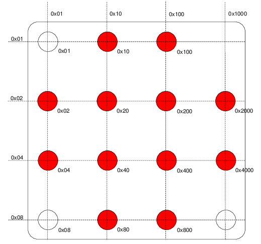

# ROS Wrapper for Stargazer Library

This package provides an GPS-like camera-based indoor-localization-solution.
The localization is given as a transformation from the stargazer frame to the camera frame.

## Installation

Within the MRT build system, installation only requires a simple:

~~~{.shell}
    mrt pkg add stargazer_ros_tool
    mrt catkin build
~~~

## Usage

Mount a camera on your robot, point it towards the ceiling and go.

The main pipeline for running the localization part of the stargazer lib can be run via:

~~~{.shell}
    source devel/setup.bash
    roslaunch stargazer_ros_tool stargazer_nodelets.launch
~~~

### Localization
Launch 
    roslaunch stargazer_ros_tool stargazer_nodelets.launch

### Visualization
For visualization of the landmarks and the agent launch
    roslaunch stargazer_ros_tool landmark_visualizer.launch

## How it works

The Stargazer-System is a indoor localization system for mobile robots.
Analog to navigation in seafaring with the help of stellar constellations, here the own position is acquired by observing Infrared-LED markers on the ceiling.
The landmarks are mounted (or suspended from) the rooms ceiling.
Each landmark has an individual ID, encoded by the pattern of the LEDs, similar to a stellar constellation.

The robot to be localized is therefor equipped with a camera, pointing upwards, with the stargazer software for image processing and localization and of course with the knowledge of the true positions of the landmarks.

The positions of the landmarks are known (or can be calibrated, see [Calibration](doc/Calibration.md)).

### Landmarks
The landmarks are quadratic PCBs that are about 30cm x 30 cm in size.
The LEDs are arranged in a 4×4 Grid, their concrete constellation encoding the landmarks ID.
Three of the corner LEDs are always set, while the fourth corner stays unset. These corner points encode the orientation of the landmark.
The other, up to 12, LEDs encode the ID.

For encoding, the hexadecimal system is used.
Each of the set LEDs represents one number.
The sum of all active LEDs yield the landmarks LED. Encoding works by two simple rules, beginning with to upper left corner, each shift
* by one row results in a multiplication by 2
* by one column results in a bitshift left (in the decimal system: a multiplication by 16)
Note, that the resulting ID is in the hexadecimal system.

The following graphic, will hopefully visualize this encoding system.
Note that the unset corner marks the upper right corner!

More Information on the Landmarks can be found in the [original Stargazer Manual](http://www.hagisonic.com).

## Setting up the system

To get started, the following steps have to be conducted.

### Activating the landmarks
Plugin the stargazer system. You will find a power plug on the side of the machine hall.
Don't forget to plug it out again, after you are done!

### Setting up the camera
The system works best, if only the LEDs are seen.
To assert that, disable auto exposure for your camera and adjust the aperture until you get an image as in the picture below.

If your camera has an optical zoom, you should adjust it to see as many landmarks as possible.

### Calibration
 1. Record rosbag of poses and landmarks using 
    roslaunch stargazer_ros_tool stargazer_nodelets.launch record:=true
 2. Start calibration
    roslaunch stargazer_ros_tool landmark_calibrator.launch

**Optional:** after a successful calibration, you can upload the estimated intrinsics to your camera/camera-node by launching:
   roslaunch stargazer_ros_tool upload_intrinsics.launch camera_ns:=/camera/namespace 

### Getting the pictures into ROS
There are lots of ready to use camera drivers for ROS available.
See the [ROS Wiki page for camera drivers](http://wiki.ros.org/camera_drivers) for example.

Make sure to undistort the pictures if your objective adds high distortion.

## Further Documentation

The documentation for this package is written in doyxgen and markdown.
You can either view it in Gitlab or, to display the documentation locally, call

~~~{.shell}
    mrt doc show stargazer_ros_tool
~~~

## Contributing

1. Fork it!
2. Create your feature branch: `git checkout -b my-new-feature`
3. Commit your changes: `git commit -am 'Add some feature'`
4. Push to the branch: `git push origin my-new-feature`
5. Submit a merge request

## Credits

The original system was developed by [Hagisonic](http://www.hagisonic.com).
Anyway, apart from the principal idea of using "Star-Like" Landmarks and how their IDs get enumerated, nothing remains from this original system.
All software was written in house and even the hardware is an own development.

## License

This program is free software: you can redistribute it and/or modify
it under the terms of the GNU General Public License as published by
the Free Software Foundation, either version 3 of the License, or
(at your option) any later version.

This program is distributed in the hope that it will be useful,
but WITHOUT ANY WARRANTY; without even the implied warranty of
MERCHANTABILITY or FITNESS FOR A PARTICULAR PURPOSE.  See the
GNU General Public License for more details.

You should have received a copy of the GNU General Public License
along with this program.  If not, see <http://www.gnu.org/licenses/>.
